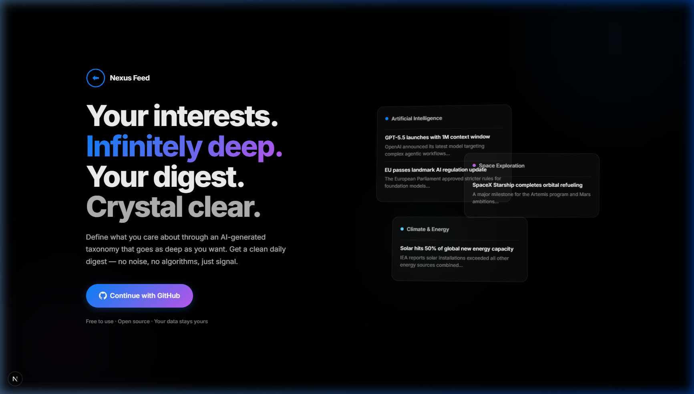

# Nexus Feed

**Your interests. Infinitely deep. Your digest. Crystal clear.**

Nexus Feed is a personalized AI-powered daily digest application. Define what you care about through an AI-generated infinite drill-down taxonomy, and receive a clean daily digest of the most important developments — no noise, no algorithms, just signal.



## Features

- **AI-Generated Dynamic Taxonomy** — Start with broad topics, and let the AI build highly-correlated lateral leaps. The system dynamically suggests specific interests based on your selections.
- **Daily Digest Generation** — Every day, the system searches the web for your interests using Tavily, then summarizes the top developments using GPT-4o.
- **Prompt Engineering Harness** — Employs advanced Chain-of-Thought (CoT) JSON prompt engineering to force the model to reason step-by-step before selecting and summarizing articles, ensuring maximum relevance and zero hallucination.
- **Real Source Links** — Every digest item links back to the original article from real publications (CNN, Reuters, Bloomberg, etc.)
- **Clean, Zero-Noise UI** — Apple-inspired dark theme with glassmorphism, smooth animations, and premium typography.
- **Simple Auth** — Username/password signup. No OAuth complexity.
- **Vercel Ready** — Built specifically for serverless deployments using Turso cloud database.

## Tech Stack

| Layer | Technology |
|---|---|
| **Framework** | Next.js 16 (App Router, Turbopack) |
| **Auth** | Custom session management (SHA-256 token hashing, secure cookies) |
| **Database** | Turso (libSQL) |
| **ORM** | Drizzle ORM |
| **AI Models** | OpenAI GPT-4o-mini (fast ops) + GPT-4o (summarization) |
| **Web Search** | Tavily API |
| **Styling** | Vanilla CSS with Apple-inspired design system |

## Getting Started

### Prerequisites

- Node.js 18+
- OpenAI API key ([get one here](https://platform.openai.com/api-keys))
- Tavily API key (optional, [get one here](https://tavily.com)) — enables real-time web search for digests

### Installation

```bash
# Clone the repository
git clone https://github.com/G26karthik/Nexus-Feed.git
cd Nexus-Feed/nexus-feed

# Install dependencies
npm install

# Set up environment variables
cp .env.example .env.local
# Edit .env.local and add your API keys

# Initialize the database
npm run db:push

# Start the development server
npm run dev
```

Open [http://localhost:3000](http://localhost:3000) to see the app.

### Environment Variables

| Variable | Required | Description |
|---|---|---|
| `OPENAI_API_KEY` | ✅ Yes | OpenAI API key for topic generation and digest summarization |
| `TAVILY_API_KEY` | ✅ Yes | Tavily API key for real-time web search |
| `TURSO_DATABASE_URL` | ✅ Yes | Your Turso DB URL (e.g. libsql://nexus-feed-user.turso.io) |
| `TURSO_AUTH_TOKEN` | ✅ Yes | Your Turso Auth Token |
| `CRON_SECRET` | ✅ Yes | Secret for the daily cron endpoint (for Vercel) |

## Project Structure

```
nexus-feed/
├── app/
│   ├── api/
│   │   ├── auth/          # Login, signup, signout endpoints
│   │   ├── digest/        # Daily digest generation & retrieval
│   │   ├── interests/     # User interest CRUD
│   │   └── topics/        # AI-powered topic trending & expansion
│   ├── dashboard/         # Main digest view
│   ├── interests/         # Edit interests page
│   ├── login/             # Login/signup page
│   ├── onboarding/        # Interest selection wizard
│   ├── globals.css        # Design system (Apple-inspired dark theme)
│   ├── layout.tsx         # Root layout with ambient orb lighting
│   └── page.tsx           # Landing page
├── lib/
│   ├── ai/
│   │   ├── openai.ts      # GPT integration (topics, expansion, summarization)
│   │   ├── tavily.ts      # Web search with deduplication
│   │   └── pipeline.ts    # Full digest generation pipeline
│   ├── auth/
│   │   └── session.ts     # Session management, password hashing
│   └── db/
│       ├── index.ts       # Database client (SQLite/Turso)
│       └── schema.ts      # Drizzle ORM schema (5 tables)
├── middleware.ts           # Route protection
├── drizzle.config.ts       # Database configuration
└── vercel.json             # Cron job configuration
```

## How It Works

1. **Sign Up** — Create an account with a username and password
2. **Choose Interests** — AI generates 10 live global trending topics. Select topics to instantly trigger an AI recalculation of new, laterally correlated recommendations.
3. **Get Your Digest** — The system generates precise search queries, searches the web via Tavily, and uses a Chain-of-Thought JSON harness with GPT-4o to extract and summarize findings into a clean daily digest.
4. **Daily Updates** — A cron job (configurable via Vercel) regenerates digests every morning at 6 AM UTC.

## Available Scripts

| Command | Description |
|---|---|
| `npm run dev` | Start development server |
| `npm run build` | Build for production |
| `npm run start` | Start production server |
| `npm run db:push` | Push schema to database |
| `npm run db:generate` | Generate migration files |
| `npm run db:studio` | Open Drizzle Studio (DB browser) |

## Deployment

### Vercel (Recommended)

1. Push to GitHub
2. Import project in [Vercel](https://vercel.com)
3. Set environment variables (`OPENAI_API_KEY`, optionally `TAVILY_API_KEY`)
4. For production database, create a [Turso](https://turso.tech) database and set `TURSO_DATABASE_URL` + `TURSO_AUTH_TOKEN`
5. Deploy

The included `vercel.json` configures a daily cron job at 6 AM UTC for digest generation.

## License

MIT
